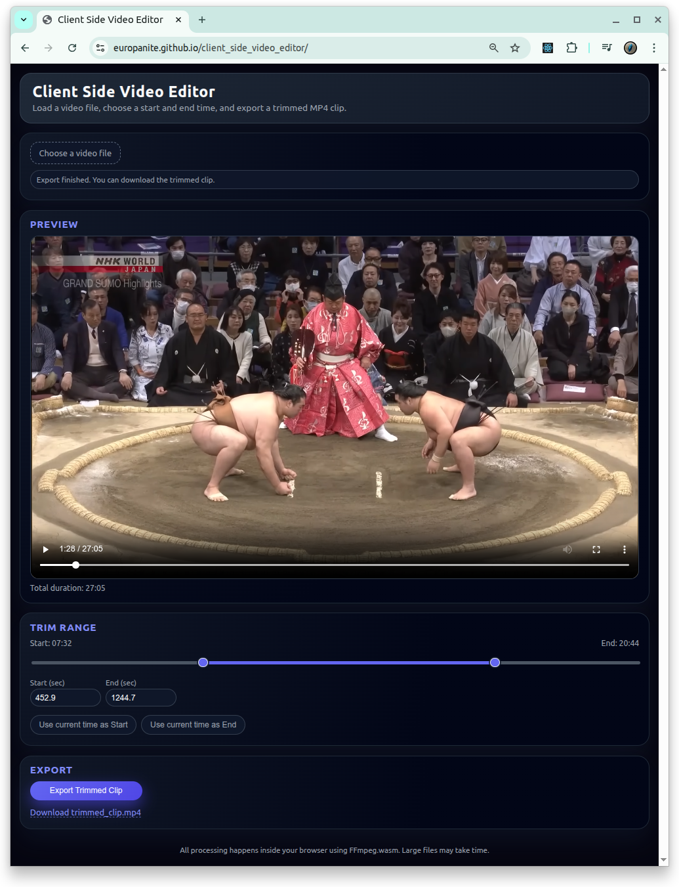

# [Client Side Video Editor](https://github.com/europanite/client_side_video_editor "Client Side Video Editor")

[](https://opensource.org/licenses/Apache-2.0)

[](https://github.com/europanite/client_side_video_editor/actions/workflows/ci.yml)
[](https://github.com/europanite/client_side_video_editor/actions/workflows/docker.yml)
[](https://github.com/europanite/client_side_video_editor/actions/workflows/pages.yml)


<p align="right">
  <a href="https://europanite.github.io/client_side_video_editor/">🇺🇸 English</a> |
  <a href="https://europanite.github.io/client_side_video_editor/hi/">🇮🇳 हिंदी</a> |
  <a href="https://europanite.github.io/client_side_video_editor/ja/">🇯🇵 日本語</a> |
  <a href="https://europanite.github.io/client_side_video_editor/zh-CN/">🇨🇳 简体中文</a> |
  <a href="https://europanite.github.io/client_side_video_editor/es/">🇪🇸 Español</a> |
  <a href="https://europanite.github.io/client_side_video_editor/pt-BR/">🇧🇷 Português (Brasil)</a> |
  <a href="https://europanite.github.io/client_side_video_editor/ko/">🇰🇷 한국어</a> |
  <a href="https://europanite.github.io/client_side_video_editor/de/">🇩🇪 Deutsch</a> |
  <a href="https://europanite.github.io/client_side_video_editor/fr/">🇫🇷 Français</a>
</p>



 [PlayGround](https://europanite.github.io/client_side_video_editor/)

Ein kostenloser clientseitiger, browserbasierter Video-Editor.

Ein **100% clientseitiger Video-Micro-Editor**, der vollständig in deinem Browser läuft.  
Du kannst:
- **Einen Zeitbereich trimmen**
- **Rechteckig zuschneiden**
- **Den Clip exportieren**

Kein Server ist erforderlich.
Alles wird mit **HTML5 Video + Canvas + MediaRecorder** erledigt.

---

### Schritte

1. Wähle eine Videodatei aus.
2. Lege den **crop** fest:
   - Bewege den Cursor über die Videovorschau.
   - Klicke und ziehe, um ein Rechteck (Zuschneidebereich) zu zeichnen.
   - Doppelklicke in die Vorschau, um den Zuschnitt zurückzusetzen.
3. Passe den **trim range** an:
   - Verschiebe Start/End auf dem Slider, _oder_
   - Spiele das Video ab und klicke:
     - **Use current time as Start**
     - **Use current time as End**
4. Klicke auf **Export**.
5. Warte, bis der Export abgeschlossen ist:

---

### 🔒 Datenschutz

- Es wird niemals eine Datei auf einen Server hochgeladen.
- Die gesamte Verarbeitung erfolgt lokal in deinem Browser-Tab.
- Sicher für private Aufnahmen, Bildschirmaufnahmen usw.

---

## 🚀 Erste Schritte

### 1. Voraussetzungen
- [Docker Compose](https://docs.docker.com/compose/)

### 2. Alle Services bauen und starten:

```bash

# Build the image
docker compose build

# Run the container
docker compose up

```

### 3. Test:
```bash
docker compose \
-f docker-compose.test.yml up \
--build --exit-code-from \
frontend_test
```

---

## Technischer Überblick

### 1. Tech-Stack

- **Frontend:** React + TypeScript + Vite  
- **Styling:** Plain CSS (`src/style.css`)
- **Tests:** Jest + ts‑jest  
- **Container:** Docker / Docker Compose für reproduzierbare Entwicklung und Tests

### 2. Datenfluss

1. **Dateieingabe**
   - Der Benutzer wählt/zieht eine Datei hinein -> sie wird als `File` im React State gespeichert.

2. **Metadaten und dimensions**
   - `onLoadedMetadata` liest:
     - `video.duration`
     - `video.videoWidth`, `video.videoHeight`
   - Diese werden verwendet für:
     - Bereich des Trim-Sliders (0 → duration)
     - Umrechnung der Zuschneidekoordinaten von CSS space → video pixel space.

3. **Trim-Bereich**
   - Zwei numeric states:
     - `trimStart: number`
     - `trimEnd: number`
   - Slider und numeric inputs bleiben synchron.
   - constraints:
     - `0 ≤ trimStart ≤ trimEnd ≤ duration`

4. **Zuschneiderechteck**
   - Pointer events auf `<video>`:
     - `pointerdown`: Zuschnitt beginnen
     - `pointermove`: Zuschnitt während des Ziehens aktualisieren
     - `pointerup` / `pointerleave`: finalize crop
   - coordinates werden anhand der bounding box des Videos normalize und auf die native resolution scale:

5. **Export**
   - `canvas.width / height` = width/height des Zuschnitts (oder vollständige video size).
   - `canvas.captureStream(fps)` erhält einen `MediaStream`.
   - Frames werden mit `requestAnimationFrame` gezeichnet, bis:
     - `now >= endTime` oder `video.currentTime >= trimEnd`
   - Nach Abschluss:
     - `MediaRecorder.stop()`
     - Chunks werden zu einem `Blob` kombiniert und heruntergeladen.

---

# Lizenz
- Apache License 2.0
