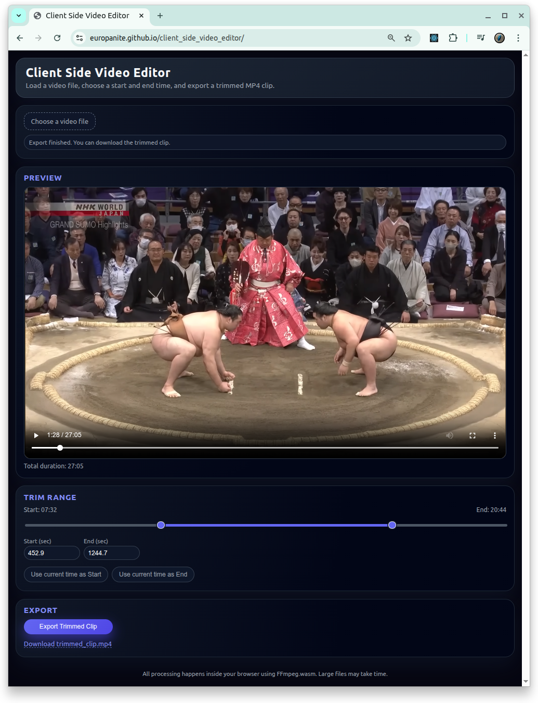

# [Client Side Video Editor](https://github.com/europanite/client_side_video_editor "Client Side Video Editor")

[](https://github.com/europanite/client_side_video_editor/actions/workflows/ci.yml)
[](https://github.com/europanite/client_side_video_editor/actions/workflows/docker.yml)
[](https://github.com/europanite/client_side_video_editor/actions/workflows/pages.yml)



 [PlayGround](https://europanite.github.io/client_side_video_editor/)

A Client-Side Browser-Based Video Editor for Free.

---

## 🚀 Getting Started

### 1. Prerequisites
- [Docker Compose](https://docs.docker.com/compose/)

### 2. Build and start all services:

```bash

# Build the image
docker compose build

# Run the container
docker compose up

```

### 3. Test:
```bash
docker compose \
-f docker-compose.test.yml up \
--build --exit-code-from \
frontend_test
```

---

# License
- Apache License 2.0